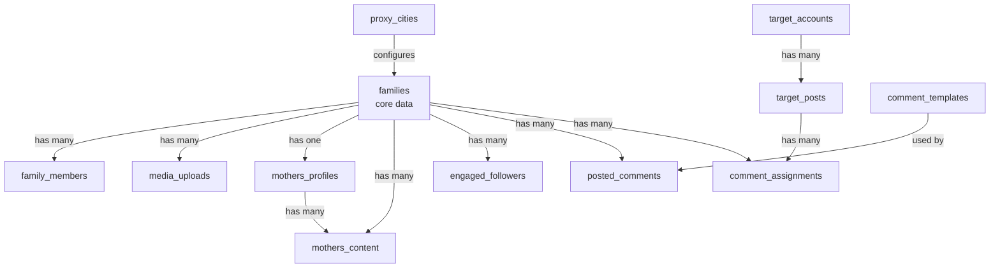

# Project API Map

Complete mapping of all API endpoints in [`server.js`](server.js) to their associated Supabase tables, with identification of integration points for **AdsPower** (browser fingerprint management) and **fal.ai** (AI image generation).

---

## Supabase Tables Overview

| Table | Purpose |
|-------|---------|
| [`families`](SCHEMA_SNAPSHOT.md:98) | Core family data, IG credentials, automation switches |
| [`family_members`](SCHEMA_SNAPSHOT.md:151) | Individual family member details |
| [`media_uploads`](SCHEMA_SNAPSHOT.md:182) | Family-uploaded media files |
| [`mothers_profiles`](SCHEMA_SNAPSHOT.md:214) | Scraped Instagram profile data |
| [`mothers_content`](SCHEMA_SNAPSHOT.md:192) | Scraped Instagram posts/content |
| [`engaged_followers`](SCHEMA_SNAPSHOT.md:58) | Likers/commenters from posts |
| [`engaged_followers_summary`](SCHEMA_SNAPSHOT.md:72) | Aggregated engagement stats |
| [`posted_comments`](SCHEMA_SNAPSHOT.md:233) | Comments posted by automation |
| [`comment_templates`](SCHEMA_SNAPSHOT.md:35) | AI comment templates |
| [`comment_assignments`](SCHEMA_SNAPSHOT.md:15) | Comment scheduling assignments |
| [`comment_schedule`](SCHEMA_SNAPSHOT.md:26) | Time slots for commenting |
| [`target_accounts`](SCHEMA_SNAPSHOT.md:280) | Accounts to monitor for posts |
| [`target_posts`](SCHEMA_SNAPSHOT.md:296) | Discovered posts for commenting |
| [`proxy_cities`](SCHEMA_SNAPSHOT.md:267) | Proxy location configuration |
| [`profile_scrape_status`](SCHEMA_SNAPSHOT.md:251) | View: scrape status per family |
| [`warmup_status`](SCHEMA_SNAPSHOT.md:308) | View: warmup progress per family |
| [`automation_overview`](SCHEMA_SNAPSHOT.md:1) | View: automation status summary |
| [`engagement_quality_report`](SCHEMA_SNAPSHOT.md:84) | View: target account quality scores |
| [`family_with_members`](SCHEMA_SNAPSHOT.md:167) | View: family + member join |
| [`comments_deployed`](SCHEMA_SNAPSHOT.md:46) | Legacy: deployed comments |

---

## API Endpoint Map

### 1. Static & Health Routes

| Endpoint | Method | Tables | Description |
|----------|--------|--------|-------------|
| `/` | GET | - | Serve [`public/index.html`](public/index.html) |
| `/up` | GET | - | Health check endpoint |
| `/f/:familyId` | GET | [`families`](SCHEMA_SNAPSHOT.md:98) | Fundraising URL redirect |

---

### 2. Admin Routes (Basic Auth)

#### Account Creation & Management

| Endpoint | Method | Tables | Description |
|----------|--------|--------|-------------|
| `/admin` | GET | - | Serve admin dashboard |
| `/api/families` | GET | [`families`](SCHEMA_SNAPSHOT.md:98) | List all families (basic info) |
| `/api/admin/generate-username/:familyId` | GET | [`families`](SCHEMA_SNAPSHOT.md:98) | Generate IG username suggestions |
| `/api/admin/save-account/:familyId` | POST | [`families`](SCHEMA_SNAPSHOT.md:98) | Save IG credentials (encrypted) |
| `/api/admin/account-status/:familyId` | POST | [`families`](SCHEMA_SNAPSHOT.md:98) | Update IG account status |
| `/api/admin/accounts` | GET | [`families`](SCHEMA_SNAPSHOT.md:98) | List all with account status |

#### Warm-up Management

| Endpoint | Method | Tables | Description |
|----------|--------|--------|-------------|
| `/api/admin/warmup/status` | GET | [`families`](SCHEMA_SNAPSHOT.md:98), [`warmup_status`](SCHEMA_SNAPSHOT.md:308) | Get warmup progress |
| `/api/admin/warmup/:familyId` | POST | [`families`](SCHEMA_SNAPSHOT.md:98) | **Trigger warmup for family** |
| `/api/admin/warmup/run-all` | POST | [`families`](SCHEMA_SNAPSHOT.md:98) | **Trigger warmup for all** |

> **AdsPower Integration Point #1**: Warmup routes should use AdsPower profiles for each family to maintain consistent browser fingerprints during warmup sessions.

#### Automation Control

| Endpoint | Method | Tables | Description |
|----------|--------|--------|-------------|
| `/api/admin/automation/:familyId` | POST | [`families`](SCHEMA_SNAPSHOT.md:98) | Toggle single automation switch |
| `/api/admin/automation/:familyId/bulk` | POST | [`families`](SCHEMA_SNAPSHOT.md:98) | Bulk toggle switches |
| `/api/admin/automation/status` | GET | [`families`](SCHEMA_SNAPSHOT.md:98), [`automation_overview`](SCHEMA_SNAPSHOT.md:1) | Get automation status |
| `/api/trigger` | POST | [`families`](SCHEMA_SNAPSHOT.md:98) | **Manual automation run** |
| `/api/admin/scheduler/trigger` | POST | [`comment_schedule`](SCHEMA_SNAPSHOT.md:26), [`comment_assignments`](SCHEMA_SNAPSHOT.md:15) | Trigger comment round |
| `/api/admin/engagement/trigger` | POST | [`posted_comments`](SCHEMA_SNAPSHOT.md:233) | Check comment engagement |

> **AdsPower Integration Point #2**: `/api/trigger` and scheduler endpoints need AdsPower profile selection per family for Instagram automation.

---

### 3. Portal Routes (Family-Facing)

#### Authentication

| Endpoint | Method | Tables | Description |
|----------|--------|--------|-------------|
| `/api/portal/register` | POST | [`families`](SCHEMA_SNAPSHOT.md:98) | Family registration |
| `/api/portal/login` | POST | [`families`](SCHEMA_SNAPSHOT.md:98) | Family login |
| `/api/portal/forgot-password` | POST | [`families`](SCHEMA_SNAPSHOT.md:98) | Request password reset |
| `/api/portal/reset-password` | POST | [`families`](SCHEMA_SNAPSHOT.md:98) | Reset password |

#### Profile Management

| Endpoint | Method | Tables | Description |
|----------|--------|--------|-------------|
| `/api/portal/me` | GET | [`families`](SCHEMA_SNAPSHOT.md:98) | Get current family profile |
| `/api/portal/profile` | POST | [`families`](SCHEMA_SNAPSHOT.md:98) | Update family profile |

#### Media Management

| Endpoint | Method | Tables | Description |
|----------|--------|--------|-------------|
| `/api/portal/upload` | POST | [`media_uploads`](SCHEMA_SNAPSHOT.md:182) | Upload media file |
| `/api/portal/media` | GET | [`media_uploads`](SCHEMA_SNAPSHOT.md:182) | List family media |
| `/api/portal/media/update` | POST | [`media_uploads`](SCHEMA_SNAPSHOT.md:182) | Update media description |
| `/api/portal/media/delete` | POST | [`media_uploads`](SCHEMA_SNAPSHOT.md:182) | Delete media |

> **fal.ai Integration Point #1**: Media upload could trigger AI image generation/modification via fal.ai before storage.

#### Instagram Integration

| Endpoint | Method | Tables | Description |
|----------|--------|--------|-------------|
| `/api/portal/instagram/check-public` | POST | - | Validate IG account is public |
| `/api/portal/instagram/scrape` | POST | [`mothers_profiles`](SCHEMA_SNAPSHOT.md:214), [`mothers_content`](SCHEMA_SNAPSHOT.md:192) | **Scrape IG profile** |
| `/api/portal/instagram/profile` | GET | [`mothers_profiles`](SCHEMA_SNAPSHOT.md:214), [`mothers_content`](SCHEMA_SNAPSHOT.md:192) | Get scraped profile |
| `/api/portal/instagram/unlink` | POST | [`families`](SCHEMA_SNAPSHOT.md:98), [`mothers_profiles`](SCHEMA_SNAPSHOT.md:214), [`mothers_content`](SCHEMA_SNAPSHOT.md:192) | Unlink IG account |
| `/api/portal/instagram/content` | GET | [`mothers_content`](SCHEMA_SNAPSHOT.md:192) | Get scraped posts |
| `/api/portal/instagram/content/update` | POST | [`mothers_content`](SCHEMA_SNAPSHOT.md:192) | Update post description |
| `/api/portal/instagram/backup-followers` | POST | [`engaged_followers`](SCHEMA_SNAPSHOT.md:58) | **Backup likers/commenters** |
| `/api/portal/instagram/engaged-followers-count` | GET | [`engaged_followers`](SCHEMA_SNAPSHOT.md:58) | Get follower count |

> **AdsPower Integration Point #3**: Instagram scraping should use AdsPower profiles to avoid detection.

---

### 4. Instagram Auth Routes

| Endpoint | Method | Tables | Description |
|----------|--------|--------|-------------|
| `/api/login` | POST | [`families`](SCHEMA_SNAPSHOT.md:98) | **IG login with credentials** |
| `/api/2fa` | POST | [`families`](SCHEMA_SNAPSHOT.md:98) | Submit 2FA code |

> **AdsPower Integration Point #4**: IG login should use AdsPower browser instances with unique fingerprints per family.

---

### 5. Admin API Routes (Token Auth)

| Endpoint | Method | Tables | Description |
|----------|--------|--------|-------------|
| `/api/admin/login` | POST | - | Admin authentication |
| `/api/admin/families` | GET | [`families`](SCHEMA_SNAPSHOT.md:98) | Get all families (admin view) |
| `/api/admin/impersonate/:familyId` | POST | [`families`](SCHEMA_SNAPSHOT.md:98) | Impersonate family |
| `/api/admin/media` | GET | [`media_uploads`](SCHEMA_SNAPSHOT.md:182), [`families`](SCHEMA_SNAPSHOT.md:98) | Get all media uploads |
| `/api/admin/scrapes` | GET | [`profile_scrape_status`](SCHEMA_SNAPSHOT.md:251) | Get scrape status view |
| `/api/admin/backup-followers/:familyId` | POST | [`engaged_followers`](SCHEMA_SNAPSHOT.md:58), [`families`](SCHEMA_SNAPSHOT.md:98) | Admin: backup followers |
| `/api/admin/engaged-followers/:familyId` | GET | [`engaged_followers`](SCHEMA_SNAPSHOT.md:58) | Get family followers |
| `/api/admin/engaged-followers-summary` | GET | [`engaged_followers_summary`](SCHEMA_SNAPSHOT.md:72) | Get followers summary view |
| `/api/admin/stats` | GET | [`families`](SCHEMA_SNAPSHOT.md:98), [`media_uploads`](SCHEMA_SNAPSHOT.md:182) | Dashboard statistics |

---

## Integration Slots

### AdsPower Integration Points

AdsPower is a multi-login browser for managing multiple accounts with unique fingerprints. Integration needed at:

| Location | File | Line | Purpose |
|----------|------|------|---------|
| Warmup execution | [`warmup-scheduler.js`](warmup-scheduler.js) | - | Launch warmup in AdsPower profile |
| Instagram automation | [`instagram-automation.js`](instagram-automation.js) | - | Use AdsPower browser instead of Puppeteer |
| Profile scraping | [`apify-scraper.js`](apify-scraper.js) | - | Route scraper through AdsPower proxy |
| Login flow | [`server.js`](server.js:1618) | 1618 | Launch browser via AdsPower API |

**Required AdsPower Fields in [`families`](SCHEMA_SNAPSHOT.md:98) table:**
- `adspower_profile_id` - AdsPower profile identifier
- `adspower_group_id` - Group for organizing profiles
- `proxy_config` - Proxy settings JSON

### fal.ai Integration Points

fal.ai provides AI image generation. Integration needed at:

| Location | File | Purpose |
|----------|------|---------|
| Media processing | [`server.js`](server.js:920) | Post-upload image generation/enhancement |
| Content creation | New endpoint | Generate images for posts |
| Profile pictures | [`server.js`](server.js:1646) | AI-generated profile variations |

**Required fal.ai Fields in [`families`](SCHEMA_SNAPSHOT.md:98) table:**
- `fal_ai_enabled` - Boolean to enable AI features
- `ai_image_prompts` - JSON of saved prompts
- `generated_images` - Array of fal.ai image URLs

---

## Database Relationships

---

## Key Files Reference

| File | Purpose |
|------|---------|
| [`server.js`](server.js) | Main Express server with all API routes |
| [`instagram-automation.js`](instagram-automation.js) | Puppeteer-based IG automation |
| [`warmup-scheduler.js`](warmup-scheduler.js) | Daily warmup session scheduler |
| [`comment-scheduler.js`](comment-scheduler.js) | Comment posting scheduler |
| [`engagement-tracker.js`](engagement-tracker.js) | Comment engagement monitoring |
| [`apify-scraper.js`](apify-scraper.js) | Instagram profile/content scraper |
| [`b2-storage.js`](b2-storage.js) | Backblaze B2 storage integration |
| [`encryption.js`](encryption.js) | Cookie encryption utilities |
| [`username-generator.js`](username-generator.js) | IG username suggestion generator |
| [`youcom-agent.js`](youcom-agent.js) | You.com AI agent integration |

---

## Environment Variables Needed

### Current
- `SUPABASE_URL` / `SUPABASE_SERVICE_KEY` - Database
- `B2_KEY_ID` / `B2_APPLICATION_KEY` / `B2_BUCKET_NAME` - Storage
- `YOUCOM_API_KEY` / `YOUCOM_AGENT_ID` - AI comments
- `APIFY_API_TOKEN` - Instagram scraping
- `SMTP_*` - Email sending
- `N8N_BASIC_AUTH_*` - Admin auth

### AdsPower (New)
- `ADSPOWER_API_URL` - AdsPower API endpoint
- `ADSPOWER_API_KEY` - API authentication
- `ADSPOWER_DEFAULT_GROUP` - Default profile group

### fal.ai (New)
- `FAL_AI_API_KEY` - fal.ai API key
- `FAL_AI_WEBHOOK_SECRET` - Webhook verification
